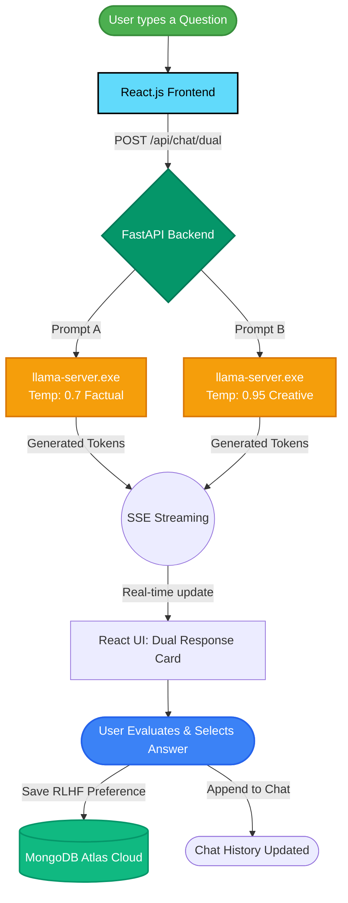

# 🚗 Car Specialist GPT - The Complete Journey (Presentation Guide)

Yeh document aapke project ki complete **"Story"** aur architecture ko explain karta hai. Presentation ke waqt aap is narrative ko follow kar saktay hain taake evaluators ko project ka asal vision samajh aaye.

---

## 📖 1. The Story: Kyun aur Kaise Shuru Hua?
Aaj kal har koi ChatGPT aur OpenAI ki API use kar ke wrapper apps bana raha hai. Lekin hamara vision ek aisi app banana tha jo **100% Privacy** de aur **Zero API Cost** par chalay. Hum ek Car Specialist AI chahte thay jo offline (local hardware par) chal sake, aur sab se barh kar, woh **insani feedback se seekh sake** (RLHF - Reinforcement Learning from Human Feedback). 

Is maqsad ko pura karne ke liye humne Cloud AI APIs ko chhor kar "Local Open-Source LLMs" ka raasta chuna.

---

## 🧠 2. The Model: Picking `Gemma-4-e2b-it`
Local LLM chalane ke liye sab se bara challenge hardware hota hai. Ek normal LLM (maslan LLaMA 3 8B) ko 8GB+ VRAM chahiye hoti hai. Isliye humari research aur model selection bohut specific thi:

1. **Model Selection:** Humne **Gemma 2B (2 Billion parameters)** model select kiya. Yeh Google ka lightweight model hai jo chota hone ke bawajood reasoning aur instruction following mein behtareen hai.
2. **The "GGUF" Download (Quantization):** Original model still heavy tha. Isliye humne HuggingFace se iska **Q4_K_M (4-bit Quantized)** `.gguf` version download kiya. Quantization ne model ke weights ko compress kar diya. Jiska faida yeh hua ke model sirf **~1.6 GB** RAM leta hai aur kisi bhi aam CPU/GPU par smoothly chal jata hai bina accuracy loose kiye!

---

## ⚙️ 3. How We Run It? (The Execution Approach)
Machine learning models ko Python mein `transformers` library se chalana bohut slow hota hai. Is problem ko solve karne ke liye humne ek highly optimized approach use ki:

- **Llama.cpp (`llama-server.exe`):** Humne C++ mein likha gaya engine use kiya. Backend (FastAPI) automatically background mein `llama-server.exe` ko start karta hai. Yeh engine aapke CPU/GPU (CUDA) par model ko load karta hai aur API endpoints expose karta hai.
- **Server-Sent Events (SSE):** Backend LLM engine se connected rehta hai aur jaise hi model lafz (tokens) generate karta hai, backend usey real-time mein frontend par **Stream** kar deta hai. Isliye user ko instantly typing effect nazar aata hai!

---

## ⚖️ 4. Pre-Evaluation & Post-Evaluation (The RLHF Mechanism)
Project ki jaan iska "Dual Response" feature hai. Hum data collect kar rahay hain taake future mein is model ko fine-tune kiya ja sake.

1. **Pre-Evaluation (Prompting):** Jab user sawal karta hai, toh backend background mein **do parallel streams** start karta hai. Model ek hi sawal ke do mukhtalif jawab likhta hai. Ek jawab low temperature (0.7 - factual) par hota hai aur dusra high temperature (0.95 - creative) par.
2. **Post-Evaluation (User Feedback):** Frontend par user ko dono jawab (Response A aur B) live stream hotay hue nazar aatay hain. Pura parhne ke baad user apni pasand ka behtar jawab select karta hai (ya usay Skip kar deta hai).
3. **Continuous Learning:** User ka yeh decision (konsa answer acha tha) hamara asal dataset hai jo RLHF pipeline ke liye jama ho raha hai.

---

## 🗄️ 5. Database Saving Strategy
Agar sab kuch offline local chal raha hai, toh Database mein kya save ho raha hai?

- **MongoDB Atlas (Cloud):** Humne local database ke bajaye Cloud MongoDB use kiya. Kyun? Kyun ke agar hamari app 10 different laptops (agents) par chal rahi hai, toh AI inference unke apne laptop par free ho rahi hogi, lekin unka evaluation data (Response A vs B preference) ek central Cloud Database mein save hoga. 
- Jab user apni pasand batata hai, toh FastApi backend foran usay **MongoDB** mein push karta hai, aur sath hi usay user ki permanent Chat History mein append kar deta hai taake agli baar login karne par wohi jawab samne aye.

---

## 🛠️ 6. The Complete Tech Stack
Aapki presentation slide ke liye yeh bullet points best hain:

* **Frontend:** React.js, Vite, Zustand (State Management for smooth rendering), Vanilla CSS (ChatGPT-like sleek UI), React-Markdown.
* **Backend:** Python, FastAPI, Uvicorn (Fast Async server).
* **AI Engine:** Llama.cpp (llama-server) running `Gemma-4-e2b-it.Q4_K_M.gguf`.
* **Database:** MongoDB (Motor async driver) for storing Users, Chats, and RLHF Preferences.
* **Authentication:** JWT (JSON Web Tokens) for secure login.

---

### ✨ Pro-Tip For Evaluators:
Jab unhen demo dain, toh batayen ke *"Baaki sab external APIs use kar rahay hain jo per-message charge karti hain aur privacy risk hain. Humne apna private LLM cluster local machine par host kiya hai jo parallel dual-processing kar raha hai!"* Yeh line unhen lazmi impress karegi!

---

## 📊 7. Architecture Flowchart (User Question to Response)
Yeh diagram aapki slide mein lagane ke liye perfect hai jo pure flow ko visualizes karta hai:

