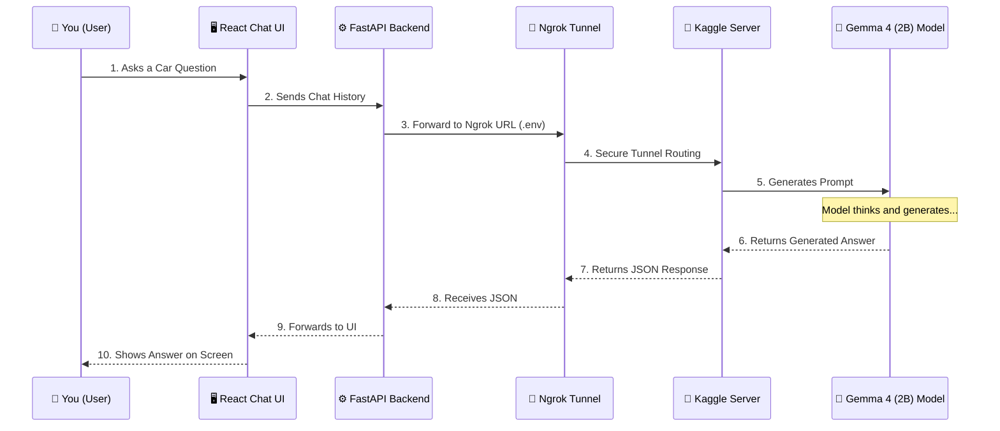

# Car Specialist GPT

An AI-powered automotive assistant designed to provide intelligent, context-aware, and conversational support for vehicle-related queries. This project features a custom fine-tuned **Gemma 4 (2B)** model hosted on a cloud GPU (Kaggle), interacting with a sleek React-based user interface.

## 🚀 Features

- **Custom Fine-Tuned AI**: Powered by a custom-trained Gemma 4 (2B) model specifically fine-tuned on car repair datasets.
- **Cloud GPU Hosting**: Model is served remotely via Kaggle using Ngrok and Unsloth for high-performance 4-bit inference.
- **Modern Chat Interface**: Responsive, interactive, and beautiful UI built with React and Tailwind CSS.
- **FastAPI Proxy Backend**: Acts as a bridge between the frontend and the cloud model, providing a seamless and secure API layer.

## 🏗️ System Architecture

The application combines a local React frontend with a local FastAPI backend that securely tunnels requests to a Kaggle-hosted instance of our fine-tuned AI model.



## 🛠️ Technology Stack

| Category | Technology |
|----------|------------|
| **Frontend Framework** | React + Vite |
| **Styling** | Tailwind CSS |
| **State Management** | Zustand |
| **Local Backend** | FastAPI (Python) |
| **Cloud Hosting Server** | Kaggle (GPU T4) + Uvicorn |
| **Tunneling** | Ngrok |
| **Model Optimization** | Unsloth (4-bit quantization) |
| **Base AI Model** | Gemma 4 (2B) |

## ⚙️ How to Run

### 1. Host the Model (Kaggle)
1. Open a new Kaggle notebook with GPU T4 enabled and Internet turned ON.
2. Run the provided hosting script using Unsloth and PyNgrok.
3. Copy the generated `Ngrok Public URL`.

### 2. Run Local Backend
1. Create a `backend/.env` file and paste the Ngrok URL:
   ```env
   API_URL=https://your-ngrok-url.ngrok-free.dev/v1/chat/completions
   MODEL_ID=ssiddiquii/merged-car-specialist-gemma
   API_KEY=dummy_key
   ```
2. Start the FastAPI server:
   ```bash
   cd backend
   uvicorn main:app --reload --port 8000
   ```

### 3. Run Frontend
1. Open a new terminal:
   ```bash
   cd frontend
   npm install
   npm run dev
   ```
2. Open your browser to `http://localhost:5173` and start chatting with your AI mechanic!

---

## 📜 License
This project is licensed under the MIT License.
