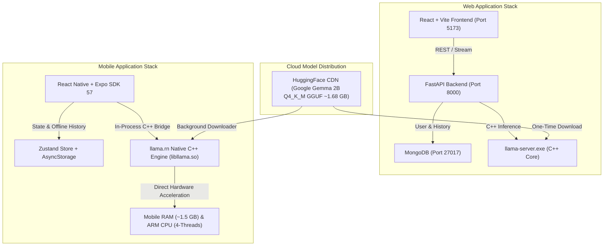

# Car Specialist AI 🏎️📱

> **The Ultimate 100% Offline Automotive Intelligence System for Web & Mobile**  
> Powered by Google Gemma 2B GGUF running locally on C++ hardware without cloud servers or API bills.

---

## 🌟 Executive Overview

**Car Specialist AI** is an advanced, privacy-first automotive intelligence platform available as both a **Web Application** and a **Standalone Native Android Mobile App**. 

Unlike conventional AI tools that rely on cloud REST APIs (OpenAI, Anthropic), Car Specialist AI executes Large Language Models (LLMs) **100% locally on your device's CPU/RAM**. Whether diagnosing OBD fault codes, comparing vehicle specs, or seeking maintenance advice, your queries never leave your hardware.

---

## ✨ Key Features

- ⚡ **100% Offline Local AI Inference:** Zero internet required after setup. Zero monthly server bills, zero API latency.
- 🔀 **Dual-Response Engine:** Simultaneously generates two distinct AI completion modes:
  - **Option A (Direct & Factual):** Low temperature (`0.3`) for concise, precise automotive specs and diagnosis.
  - **Option B (Detailed & Creative):** Higher temperature (`0.6`) for step-by-step descriptive recommendations.
- 🎠 **Swipeable Pager Carousel:** Compare responses seamlessly with horizontal swipe slides, tab selectors (`⚡ Direct` vs `💡 Descriptive`), and page indicators (`• ◦`).
- 🌗 **Dual Theme Engine (Light & Dark Mode):** Instant Sun/Moon toggle switching between:
  - **Dark Automotive Slate Mode:** Deep Charcoal (`#0F172A`), Obsidian Cards (`#1E293B`), Sapphire Blue & Amber Terracotta accents.
  - **Light Executive Mode:** Clean Warm White (`#FFFFFF`), Soft Ice Blue (`#F8FAFC`), Deep Navy Typography, Emerald Trust Badges (`#10B981`).
- 🗂️ **Sidebar Navigation & Chat History:** Slide-out drawer with `+ Start New Chat`, active chat selection, conversation deletion, and user profile management.
- 🔑 **Authentication & Guest Mode:** Secure Login / Signup authentication flow with an instant **Guest Offline Access** fallback mode.
- 📝 **Rich Markdown Rendering:** Native AST rendering for headings (`#`), bold text (`**text**`), bullet points, and code blocks without raw markdown syntax.
- 💀 **Skeleton Shimmer Loading Screens:** Pulsing placeholder animations during model initialization and streaming startup to guarantee zero "frozen app" perception.
- 📥 **Background Download Manager:** Downloads the 1.68 GB GGUF model file in the background via native OS `DownloadManager` (`FileSystemSessionType.BACKGROUND`).

---

## 🏗️ System Architecture



---

## 📱 Mobile Standalone Application (`mobile/`)

The mobile application is built with **React Native** and **Expo SDK 57**, utilizing `llama.rn` for direct native C++ hardware acceleration on mobile ARM CPUs.

### Prerequisites for Mobile
- **Node.js** (v18 or higher)
- **Expo Go** or an **Android Device / Emulator**

### Running Mobile App Locally
1. Navigate to the `mobile` folder:
   ```bash
   cd mobile
   ```
2. Install dependencies:
   ```bash
   npm install
   ```
3. Start the Expo development server:
   ```bash
   npx expo start
   ```
4. Press `a` to launch on connected Android emulator or scan the QR code with your Android phone.

### Building Standalone Android `.apk` (EAS Cloud)
To compile a native standalone Android `.apk` binary without installing Android Studio locally:
```bash
npx eas-cli build -p android --profile preview
```

---

## 💻 Web Application (`backend/` & `frontend/`)

The web application features a **FastAPI** Python backend interfacing with `llama-server.exe` and a high-speed **React/Vite** frontend.

### Prerequisites for Web
1. **Node.js** (v18 or higher)
2. **Python** (v3.10 or higher)
3. **MongoDB** running locally on default port `27017`

### Running the Web Application

Open **two** separate terminal windows:

#### Terminal 1: Backend (FastAPI + LLM)
```bash
cd backend
# Activate virtual environment
.\venv\Scripts\activate   # Windows
# source venv/bin/activate # Mac/Linux

# Start FastAPI server
uvicorn main:app --reload --port 8000
```
*Backend runs at `http://localhost:8000`.*

#### Terminal 2: Frontend (React + Vite)
```bash
cd frontend
npm install
npm run dev
```
*Frontend runs at `http://localhost:5173`.*

---

## 🔌 How to Verify 100% Offline Operation

To verify that the AI and application run completely offline without internet:
1. **Launch the application** (Web or Mobile).
2. **Complete initial model setup** (downloads Gemma 2B once).
3. **Disconnect your Wi-Fi & Cellular Data** (Airplane Mode).
4. **Ask any automotive question** (e.g., *"What does OBD code P0300 mean and how do I fix it?"*).
5. The AI will stream responses in real-time on your local hardware with zero network connectivity!

---

## 🔒 Copyright & Ownership

**Copyright © Car Specialist AI. All Rights Reserved.**  
All code, models, branding assets, and documentation are proprietary property.
