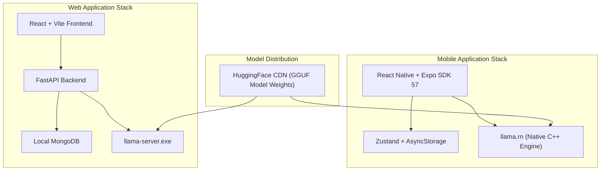

# Car Specialist AI

An offline-capable automotive assistant application exploring local Large Language Model (LLM) inference across Web and Mobile platforms.

---

## Overview

Car Specialist AI explores on-device AI capabilities for automotive domain queries, such as vehicle diagnostic information, specifications, and maintenance advice. The system operates locally without external cloud API dependencies, ensuring privacy and offline usability once the initial model files are acquired.

The project provides two target interfaces:
- **Web Application:** React + Vite frontend backed by a Python FastAPI server interfacing with `llama-server.exe` and a local MongoDB instance.
- **Mobile Application:** React Native + Expo SDK 57 application utilizing `llama.rn` C++ native bindings to execute quantized GGUF models directly on mobile hardware.

---

## Features

- **Local Inference:** Queries are processed on the local device hardware using quantized GGUF models (e.g., Google Gemma 2B), eliminating external API calls.
- **Dual Response Evaluation:** Generates two completions per query using different sampling temperatures (`0.3` for factual responses and `0.6` for descriptive advice) to allow output comparison.
- **Dual Theme Support:** Configurable Light and Dark theme modes tailored for readability.
- **Session & History Storage:** Conversation records and user authentication state are persisted locally (AsyncStorage on mobile, MongoDB on web).
- **Background Model Fetching:** Initial model downloads utilize background file sessions on mobile devices.
- **Markdown Rendering:** Formatted text output supporting lists, headings, and code snippets.

---

## Architecture



---

## Mobile Application Setup (`mobile/`)

### Requirements
- Node.js (v18 or higher)
- Expo Go app or connected Android device / emulator

### Local Development
1. Navigate to the mobile directory:
   ```bash
   cd mobile
   ```
2. Install dependencies:
   ```bash
   npm install
   ```
3. Start the Expo development server:
   ```bash
   npx expo start
   ```

---

## Web Application Setup (`backend/` & `frontend/`)

### Requirements
- Node.js (v18 or higher)
- Python (v3.10 or higher)
- Local MongoDB service on port `27017`

### Running the Web Stack

1. **Backend Server (Terminal 1):**
   ```bash
   cd backend
   .\venv\Scripts\activate   # On Windows
   # source venv/bin/activate # On Mac/Linux
   uvicorn main:app --reload --port 8000
   ```

2. **Frontend App (Terminal 2):**
   ```bash
   cd frontend
   npm install
   npm run dev
   ```

---

## Offline Testing Note

To verify offline operation:
1. Complete initial application launch and model acquisition while online.
2. Disconnect network connections (Wi-Fi / Mobile Data).
3. Submit a query to verify local generation without external network requests.

---

## Project Status & Copyright

Copyright © Car Specialist AI. All Rights Reserved.
