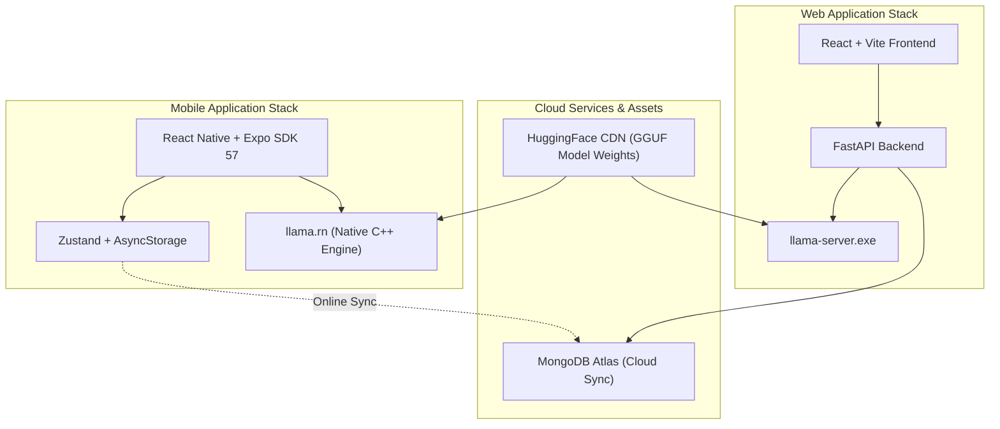

# Car Specialist AI

An offline-capable automotive assistant application exploring local Large Language Model (LLM) inference across Web and Mobile platforms with online MongoDB synchronization.

---

## Overview

Car Specialist AI explores on-device AI capabilities for automotive domain queries, such as vehicle diagnostic information, specifications, and maintenance advice. The system operates local AI model inference without external LLM cloud API costs.

The project provides two target interfaces:
- **Web Application:** React + Vite frontend backed by a Python FastAPI server interfacing with `llama-server.exe` and MongoDB Atlas for online account and conversation synchronization.
- **Mobile Application:** React Native + Expo SDK 57 application utilizing `llama.rn` C++ native bindings to execute quantized GGUF models directly on mobile hardware, with local AsyncStorage for offline persistence.

---

## Features

- **Local AI Model Inference:** Queries are processed locally on device hardware using quantized GGUF models (e.g., Google Gemma 2B), eliminating third-party LLM API latency and usage fees.
- **Online Database Synchronization:** When connected online, user accounts, preferences, and conversation logs sync automatically with MongoDB Atlas cloud database.
- **Dual Response Evaluation:** Generates two completions per query using different sampling temperatures (`0.3` for factual responses and `0.6` for descriptive advice) to allow output comparison.
- **Dual Theme Support:** Configurable Light and Dark theme modes tailored for readability.
- **Offline & Online Storage Hybrid:** Mobile app maintains local AsyncStorage for offline sessions, syncing user state with cloud database when online connectivity is available.
- **Background Model Fetching:** Initial model downloads utilize background file sessions on mobile devices.
- **Markdown Rendering:** Formatted text output supporting lists, headings, and code snippets.

---

## Architecture



---

## Mobile Application Setup (`mobile/`)

### Requirements
- Node.js (v18 or higher)
- Expo Go app or connected Android device / emulator

### Local Development
1. Navigate to the mobile directory:
   ```bash
   cd mobile
   ```
2. Install dependencies:
   ```bash
   npm install
   ```
3. Start the Expo development server:
   ```bash
   npx expo start
   ```

---

## Web Application Setup (`backend/` & `frontend/`)

### Requirements
- Node.js (v18 or higher)
- Python (v3.10 or higher)
- `MONGO_URI` configured in `backend/.env` pointing to your MongoDB Atlas cluster

### Running the Web Stack

1. **Backend Server (Terminal 1):**
   ```bash
   cd backend
   .\venv\Scripts\activate   # On Windows
   # source venv/bin/activate # On Mac/Linux
   uvicorn main:app --reload --port 8000
   ```

2. **Frontend App (Terminal 2):**
   ```bash
   cd frontend
   npm install
   npm run dev
   ```

---

## Data Synchronization & Offline Notes

1. **AI Model Inference:** Operates 100% locally on the device CPU once model weights are acquired.
2. **Cloud Database Sync:** When network connectivity is active, user profiles, preference logs, and conversation histories synchronize with MongoDB Atlas. When offline, the mobile app operates continuously using local storage.

---

## Project Status & Copyright

Copyright © Car Specialist AI. All Rights Reserved.
