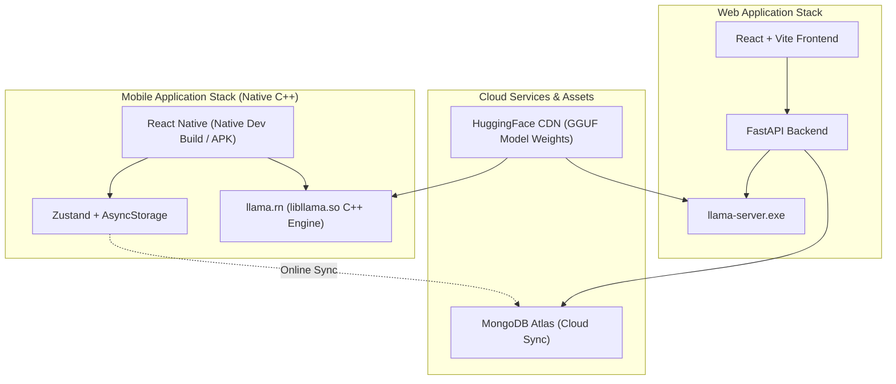

# Car Specialist AI

An offline-capable automotive assistant application exploring local Large Language Model (LLM) inference across Web and Mobile platforms with online MongoDB synchronization.

---

## Quick Access & Downloads

For quick evaluation and testing without local compilation setup:

- **Android Mobile App (.apk):** [Download Pre-Compiled APK](https://expo.dev/artifacts/eas/nWLQxaqpVZAjTieNEhACBiZvBNBSwWZ_tjrMthynwG0.apk)  
  *(Direct download link. Install on any Android device. Model downloads automatically on first launch).*
- **AI Model Repository (HuggingFace):** [Google Gemma 2B GGUF Model Weights](https://huggingface.co/google/gemma-2-2b-it-GGUF)  
  *(Public GGUF weights file ~1.68 GB used for local C++ inference).*

---

## Overview

Car Specialist AI explores on-device AI capabilities for automotive domain queries, such as vehicle diagnostic information, specifications, and maintenance advice. The system operates local AI model inference without external LLM cloud API costs.

The project provides two target interfaces:
- **Web Application:** React + Vite frontend backed by a Python FastAPI server interfacing with `llama-server.exe` and MongoDB Atlas for online account and conversation synchronization.
- **Mobile Application:** Standalone React Native application utilizing `llama.rn` C++ native bindings to execute quantized GGUF models directly on mobile hardware.

---

## Technical Architecture & Execution Modes

> **Mobile Architecture Note:** Standard **Expo Go** cannot execute this mobile application because `llama.rn` relies on custom compiled native C++ binaries (`libllama.so`). 
> 
> To test the mobile app on Android hardware:
> 1. **Option A (Recommended):** Download and install the pre-compiled **[Standalone APK](https://expo.dev/artifacts/eas/nWLQxaqpVZAjTieNEhACBiZvBNBSwWZ_tjrMthynwG0.apk)** directly.
> 2. **Option B (Developer Mode):** Execute `npx expo run:android` to compile native C++ development bindings.

### Automated Model Delivery Flow
1. Upon first launching the standalone APK or Web server setup, the system checks for local GGUF model weights.
2. If missing, the mobile application streams the **Google Gemma 2B GGUF weights (~1.68 GB)** directly from the HuggingFace CDN in background mode.
3. Once downloaded, the C++ engine (`libllama.so` / `llama-server.exe`) memory-maps the file in local RAM (~1.5 GB footprint) for 100% offline inference.

---

## Features

- **Local AI Model Inference:** Queries are processed locally on device hardware using quantized GGUF models, eliminating third-party LLM API latency and usage fees.
- **Online Database Synchronization:** When connected online, user accounts, preferences, and conversation logs sync automatically with MongoDB Atlas cloud database.
- **Dual Response Evaluation:** Generates two completions per query using different sampling temperatures (`0.3` for factual responses and `0.6` for descriptive advice) to allow output comparison.
- **Dual Theme Support:** Configurable Light and Dark theme modes tailored for readability.
- **Offline & Online Storage Hybrid:** Mobile app maintains local AsyncStorage for offline sessions, syncing user state with cloud database when online connectivity is available.
- **Background Model Fetching:** Initial model downloads utilize background file sessions on mobile devices.
- **Markdown Rendering:** Formatted text output supporting lists, headings, and code snippets.

---

## System Architecture



---

## Mobile Application Setup (`mobile/`)

### Quick Test (No Code Setup Required)
Download and install the **[Pre-Compiled Android APK](https://expo.dev/artifacts/eas/nWLQxaqpVZAjTieNEhACBiZvBNBSwWZ_tjrMthynwG0.apk)** directly on your device.

### Local Native Development
```bash
cd mobile
npm install
npx expo run:android
```

---

## Web Application Setup (`backend/` & `frontend/`)

### Requirements
- Node.js (v18 or higher)
- Python (v3.10 or higher)
- `MONGO_URI` configured in `backend/.env` pointing to your MongoDB Atlas cluster

### Running the Web Stack

1. **Backend Server (Terminal 1):**
   ```bash
   cd backend
   .\venv\Scripts\activate   # On Windows
   # source venv/bin/activate # On Mac/Linux
   uvicorn main:app --reload --port 8000
   ```

2. **Frontend App (Terminal 2):**
   ```bash
   cd frontend
   npm install
   npm run dev
   ```

---

## Offline Testing Notes

1. **AI Model Inference:** Operates 100% locally on the device CPU once model weights are acquired.
2. **Cloud Database Sync:** When network connectivity is active, user profiles, preference logs, and conversation histories synchronize with MongoDB Atlas. When offline, the mobile app operates continuously using local storage.

---

## Project Status & Copyright

Copyright © Car Specialist AI. All Rights Reserved.
