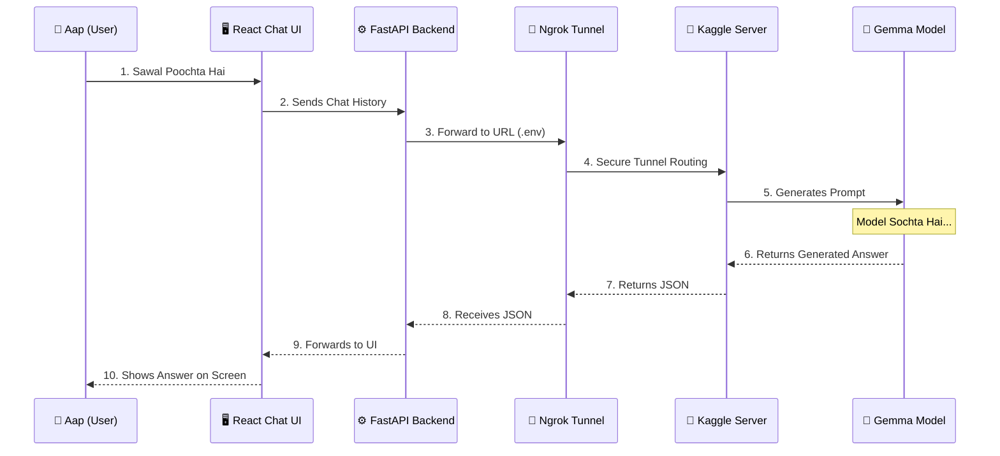

# Car Specialist GPT - Sequence Diagram

Aapki request par maine diagram ko **Sequence Diagram** mein tabdeel kar diya hai! Iska faida ye hai ke text arrows ke beech mein nahi aata, balke arrows ke bilkul upar perfectly set hota hai.

### Flow Summary:
1. **Local PC:** Aap React app par message type karte hain, jo local FastAPI ko milta hai.
2. **Internet Tunnel:** Local API wo message **Ngrok** (internet pul/tunnel) ko bhejti hai.
3. **Kaggle GPU:** Ngrok us message ko seedha Kaggle par chalne waley **Model** tak pohnchata hai.
4. **Answer:** Model jawab likh kar usi pul (tunnel) se wapis aapki screen par show kar deta hai!
